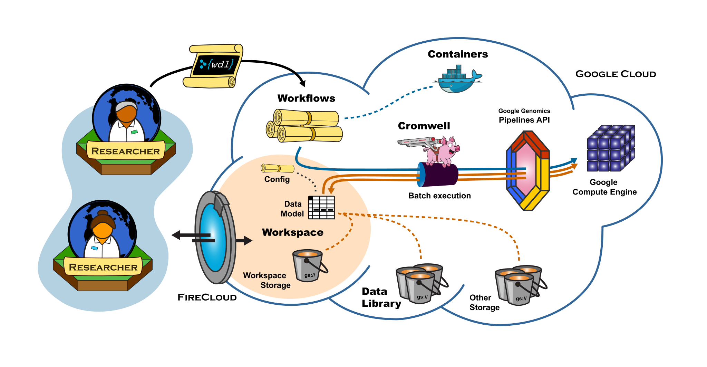

# ChIP-Seq Pipeline

When complete this ChIP-Seq pipeline will take data from the Sequence Read Archive (https://www.ncbi.nlm.nih.gov/sra) and process it using ChIP-Seq alignment and variant calling software from Bioconductor or another source. The entire workflow will be put on Terra/Firecloud where it will be executed by Cromwell on the Google Cloud Platform. The virtual machines will be configured using Docker. 

Image Credit: Broad Institute
